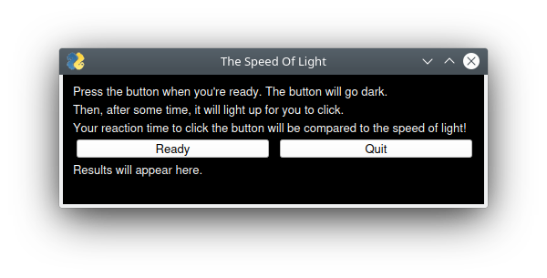
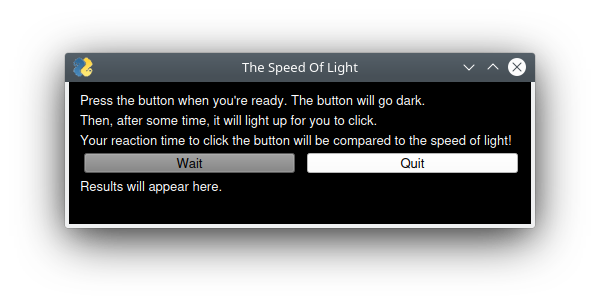
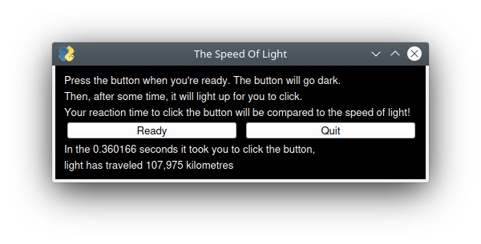
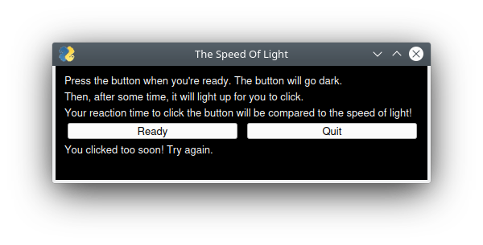

# The Speed Of Light
A simple game which tests your reaction time then compares it to the speed of light.

Created for the SFU Mountain Madness 2021 hackathon. I have very limited experience with coding GUIs so the primary focus was to get a working user interface in Qt.

## Run Instructions
This game should work on [any operating system](https://doc.qt.io/qt-5/supported-platforms.html "List of operating systems supported by Qt") with any version of Python after 3, but has only been tested on Kubuntu 20.04 with Python 3.8.5.
- set up a virtual environment  
    `python3 -m venv lightspeed`  
    `source lightspeed/bin/activate`
- install GUI library (PySimpleGUIQt and PySide2)  
    `pip3 install PySide2 PySimpleGUIQt`
- run the program  
    `python3 speedy.py`
    
## Galley

