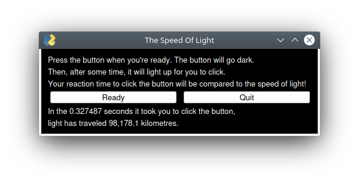

# The Speed Of Light
Created for the SFU Mountain Madness 2021 hackathon.

A simple game which tests your reaction time then compares it to the speed of light.

# Run Instructions
- set up a virtual environment  
    `python3 -m venv lightspeed`  
    `source lightspeed/bin/activate`
- install GUI library (PySimpleGUIQt and PySide2)  
    `pip3 install PySide2 PySimpleGUIQt`
- run the program  
    `python3 speedy.py`
    
# Galley

